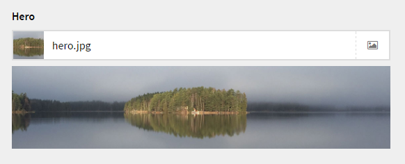
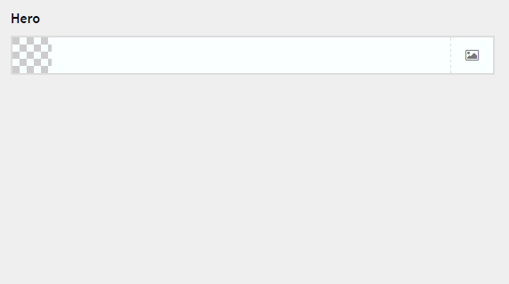

# Kirby Hero Field

*Version 2.0*

Large image preview below the field. Best suited for wide images.

**Features**

- Multi language support.
- Multi instances support.

**Screenshot**



**Animation**



**[Installation instructions](docs/install.md)**

## Setup

### 1. Blueprint

To make it work as expected, add the following code to your blueprint:

```
fields:
  yourfield:
    label: Hero
    type: hero
```

## Changelog

**2.0**

- Complete rewrite.
- CLI compatible.
- Now as a plugin instead of a field.
- Now extends the image field.
- Keeping the image field preview and append a hero preview below the field.
- Less code because of more thing inherit from the core. 

**1.0**

- Initial release

## Requirements

- [**Kirby**](https://getkirby.com/) 2.4.1+

## Disclaimer

This plugin is provided "as is" with no guarantee. Use it at your own risk and always test it yourself before using it in a production environment. If you find any issues, please [create a new issue](https://github.com/jenstornell/kirby-hero-field/issues/new).

## License

[MIT](https://opensource.org/licenses/MIT)

It is discouraged to use this plugin in any project that promotes racism, sexism, homophobia, animal abuse, violence or any other form of hate speech.

## Credits

- [Jens Törnell](https://github.com/jenstornell)